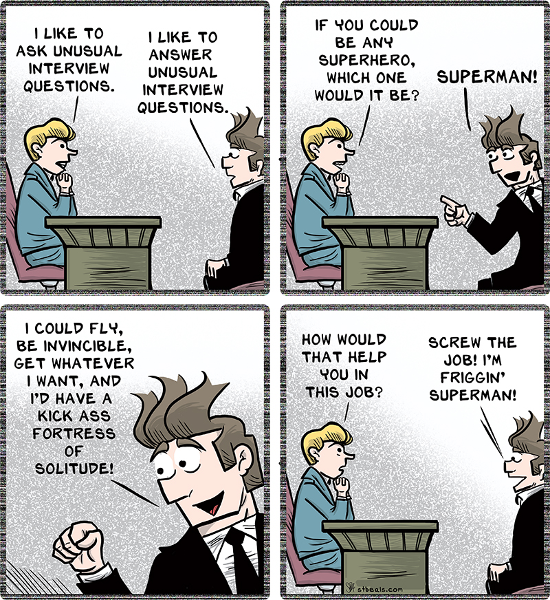

## Is There Such a Thing as a Bad Question?

Early on in my education, I often heard instructors say that “there’s no such thing as a stupid question.” While the intention behind that statement is encouraging, my experience in technical communities has shown that the way a question is asked can make a significant difference in the kind of response it receives. In software engineering especially, asking questions clearly and thoughtfully is a skill that directly affects how efficiently problems get solved.

Eric Raymond’s *How to Ask Questions the Smart Way* explains that experienced developers are usually willing to help, but only when it is clear that the person asking the question has made an effort to understand the problem. This distinction becomes very clear when comparing well-formed and poorly formed questions on Stack Overflow.

## A Smart Question in Practice

A strong example of a smart question can be found in this Stack Overflow post:

[Stack Overflow question](https://stackoverflow.com/q/79866975)

In this question, the author asks whether it is safe to access elements of an object multiple times after forwarding it as an rvalue reference. The concern revolves around C++ move semantics and the common idea that an object is in a “valid but unspecified state” after being moved from.

One of the examples provided involves forwarding a tuple and accessing its elements more than once:

```cpp
template <typename Tuple>
void func(Tuple&& tuple) {
    f1(std::get<0>(std::forward<Tuple>(tuple)));
    f2(std::get<1>(std::forward<Tuple>(tuple)));
}

int main() {
    func(std::make_tuple(std::string(), std::string()));
}
```

Another example explores calling an ```&&```-qualified member function on a ```std::optional``` and then checking its state afterward:

```cpp
template <typename Optional>
void func(Optional&& optional) {
    if (optional.has_value()) {
        f1(*std::forward<Optional>(optional));
    }
    auto b = optional.has_value();
}

int main() {
    func(std::optional(std::string()));
}
```

These snippets are short, relevant, and demonstrate the exact source of confusion without overwhelming the reader. The author also references a previous Stack Overflow answer that caused the uncertainty, showing that they had already done research and were trying to reconcile conflicting information.

This question follows Raymond’s guidelines closely. It is specific, technical, and clearly written. It shows prior effort and asks for clarification rather than demanding a solution.

## How the Responses Reflect a Smart Question

Because the question is well-structured, the responses are equally high quality. The answers explain that casting an object to an rvalue does not automatically move from it. Instead, it merely allows a move to occur later. This distinction directly addresses the author’s confusion and clears up the misconception about “giving away” an object multiple times.

The responses are calm, detailed, and efficient. There is no guesswork involved because the question provides enough context for the reader to understand the problem immediately. This demonstrates how asking a smart question leads to effective and meaningful help.

## A Not-So-Smart Question

To contrast this, consider a poorly formed Stack Overflow question (constructed for this essay):

> "My C++ code breaks when I use `std::move`. Why is C++ so confusing and broken?"

This question violates several of Raymond’s principles. It provides no code, no description of what “breaks” means, and no indication that the author attempted to research the issue. It also immediately blames the language instead of examining the programmer’s assumptions.

## Likely Outcomes of a Poor Question

A question like this would likely receive unhelpful responses. Commenters might ask for more information, point the author to basic documentation, or respond dismissively. Instead of learning something useful, the author would probably feel frustrated and discouraged.

This shows that asking bad questions does not just slow down others; it also slows down the person asking the question. Without clarity, even experienced developers cannot provide meaningful help.

## Key Takeaways

Asking smart questions is a technical skill that improves with practice. The difference between a good and bad question is not intelligence, but effort and clarity. Good questions treat the reader as a collaborator, while bad questions treat them as a debugging service.

As I continue learning computer science, I want to be more intentional about how I ask for help. Doing research, providing minimal examples, and clearly stating what I do not understand will make me a better learner and a better contributor to technical communities.


*This essay was written by me with light ChatGPT assistance for organization and clarity. All examples, analysis, and reflections are my own.*


