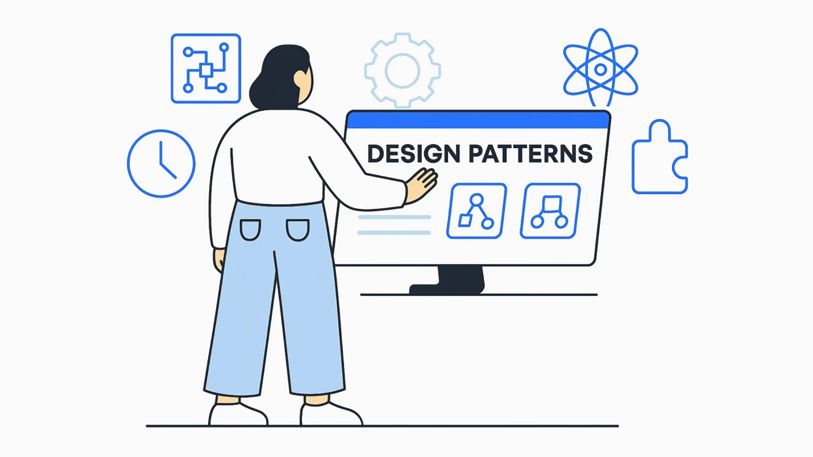

## Patterns Hidden in Plain Sight

When people first hear the phrase *design patterns*, it can sound more complicated than it really is. It brings to mind advanced theory, abstract diagrams, or secret techniques only senior engineers understand. In reality, design patterns are much more practical. They are simply common solutions to common programming problems. Instead of reinventing structure every time a developer builds something, design patterns offer proven approaches that save time and reduce mistakes.

I like to think of design patterns the same way architects use blueprints. A blueprint does not build the house for you, but it gives you a reliable plan for where walls, doors, and support beams should go. Software patterns work the same way. They provide structure so developers can focus on solving the real problem rather than guessing how everything should be organized.

Once I started working on our final project, I realized I had already been using design patterns without always knowing their formal names.

## Components Everywhere

The clearest pattern in our project was component-based design through React. Instead of building one giant page filled with repeated code, we divided the interface into reusable pieces such as `PlayerCard.tsx`, `FindPlayersBrowser.tsx`, and request status components.

For example, every player profile card on the Find Players page uses the same `PlayerCard` component. That means one structure can display many users by simply changing the data passed into it. If we want to update styling or behavior later, we change the component once instead of editing dozens of repeated sections.

This pattern matters because repetition creates bugs. Reusable components create consistency. It also makes teamwork easier because each part of the interface can be improved independently.

## Separation Creates Simplicity

Another pattern we used was separation of concerns. Different files had different responsibilities. Our pages loaded data, components handled presentation, and API routes processed actions such as creating or updating requests.

For example:

- `page.tsx` files retrieved database data.
- React components displayed the user interface.
- API routes handled request submission, acceptance, rejection, and deletion.
- Prisma managed communication with the database.

Keeping these responsibilities separate made the project easier to debug. If pagination failed, I knew to inspect the page logic. If a button looked wrong, I checked the component. If a request did not save correctly, I looked at the API route. Without that structure, every issue becomes harder to trace.

## One Database Client, Many Uses

We also used a pattern close to the Singleton pattern with Prisma. Instead of creating a brand-new database client everywhere in the project, we used one shared Prisma client instance through our library setup.

This prevents unnecessary duplicate connections and keeps database access centralized. It is one of those patterns that users never see, but it quietly improves reliability behind the scenes.

Many design patterns are like that. They are invisible when working properly, but painful when ignored.

## Reactivity and Real-Time Feedback

Our Find Players page also introduced another common modern pattern: reactive interfaces. When we improved the search bar, results updated automatically while the user typed. Pagination, search state, and rendering all responded dynamically to changes.

That kind of behavior is one reason modern web apps feel smooth. Instead of reloading entire pages unnecessarily, the interface reacts to user actions immediately. It feels simple to the user, but it depends on thoughtful design behind the scenes.

## Why Interviewers Ask About Patterns

I understand now why interviews ask about design patterns. They are not trying to test whether someone memorized names from a textbook. They want to know whether you understand maintainable structure. Can you organize code so it scales? Can you reduce duplication? Can you make teamwork easier? Can you solve problems using approaches that have already been proven useful?

Those questions matter far more than memorizing definitions.

## Final Thoughts

Before this semester, I might have described design patterns as advanced programming vocabulary. Now I would describe them as practical habits for building software well. They are reusable blueprints that help developers create cleaner, safer, and more maintainable systems.

Our final project used several of them: reusable React components, separation of concerns, shared database access, and reactive user interfaces. None of these patterns felt flashy while implementing them, but together they made the application stronger.

Good software often looks simple on the surface because thoughtful patterns are doing their job underneath.

*This essay was written by me with light ChatGPT assistance for organization and clarity.*
