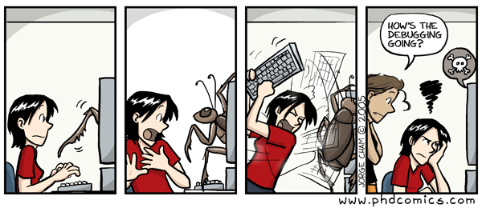

## Guessing the Work Before Doing the Work

Before working on UH GameLink, I viewed effort estimation as a rough guess rather than a real software engineering practice. It sounded simple in theory: look at an issue, predict how long it should take, complete it, and compare the result. Once I actually started doing it during the project, I learned that estimating software work is much harder than it sounds. Tasks that appear small can become unexpectedly time-consuming, while larger-looking tasks sometimes end up being straightforward.

My original estimates were usually based on gut feeling. I would look at an issue and mentally classify it as small, medium, or large. Cosmetic interface changes often felt like thirty-minute tasks. New features involving multiple pages or systems felt closer to one or two hours. I did not use historical formulas or complex planning models. Instead, I relied on intuition and whatever experience I had gained from previous assignments.

That approach was imperfect, but it was honest. I learned quickly that even imperfect estimates can still be useful.

## When Estimates Were Wrong

My estimates were mixed. Sometimes I underestimated the time required, and other times I overestimated it. One of the biggest reasons was debugging. Coding a feature often took less time than figuring out why it was not working afterward.

A strong example was fixing Vercel deployment errors. At first, deployment sounded like a quick final step. In reality, deployment exposed hidden issues such as TypeScript errors, mismatched props, build failures, and files that worked locally but failed in production. What seemed like a short task became one of the longest tasks I worked on during the project.

I noticed the same pattern with smaller issues. A simple quality-of-life improvement, such as adjusting pagination for the Find Players page or syncing pages so they worked correctly together, could take longer than expected because of side effects. Solving one issue sometimes revealed another issue.

That taught me an important lesson: in software development, the visible task is often only half of the work. The hidden half is debugging, testing, and integration.

## Tracking Actual Effort

I tracked my effort using a stopwatch on my phone. It was a simple system, but it worked well enough. I would start timing when I began focused work and stop when I finished. Because the method was easy, it was realistic to maintain during the semester.

Did tracking actual effort dramatically improve my productivity? Honestly, not by itself. I did not feel that it transformed the way I worked. However, it did provide accountability and helped me recognize which types of tasks consistently consumed more time than expected.

For example, if a supposedly quick issue repeatedly took much longer than planned, that told me my future estimates needed adjustment. It also helped me realize that coding time and debugging time are not the same thing, even if they happen during the same task.

## AI as a Time Saver and a Reality Check

I used ChatGPT throughout the project, mainly for debugging TypeScript, Next.js, Prisma, and general integration issues. Many of the questions involved build errors, component props mismatches, route issues, or logic bugs that were slowing progress.

In many cases, AI saved time by helping me identify likely causes faster than searching documentation from scratch. It was especially useful when dealing with framework-specific errors or when I needed a second perspective on why something was failing.

At the same time, AI outputs still required verification. Some suggestions were incomplete, based on outdated assumptions, or introduced new problems that needed correction. Because of that, using AI was not simply “generate answer and paste.” It still required testing, debugging, and adapting responses to fit the actual codebase.

That experience reflects how AI is becoming part of modern development: useful, fast, and productive, but not a replacement for judgment.

## What I Would Change Next Time

If I repeated this process, I would improve two things. First, I would break issues into smaller subtasks before estimating. A task like “fix request system” is too broad, while “fix request status rendering,” “fix delete permissions,” and “test request flow” are easier to estimate separately.

Second, I would separate coding time from debugging time more clearly. Many of my inaccurate estimates came from treating them as one category when debugging often takes longer than implementation.

## Final Thoughts

Before this project, effort estimation felt like administrative overhead. After using it on UH GameLink, I understand why it matters. It does not need to be perfectly accurate to be valuable. Its purpose is not prediction perfection. Its purpose is awareness.

Estimating work forced me to think before starting. Tracking time showed me where effort was really going. Most importantly, it revealed that software development is rarely just writing code. It is planning, debugging, testing, integrating, and adapting when reality does not match the estimate.

If I had to summarize the biggest lesson in one sentence, it would be this: the task you see is rarely the full task you get.

*This essay was written by me with light ChatGPT assistance for organization and clarity.*
