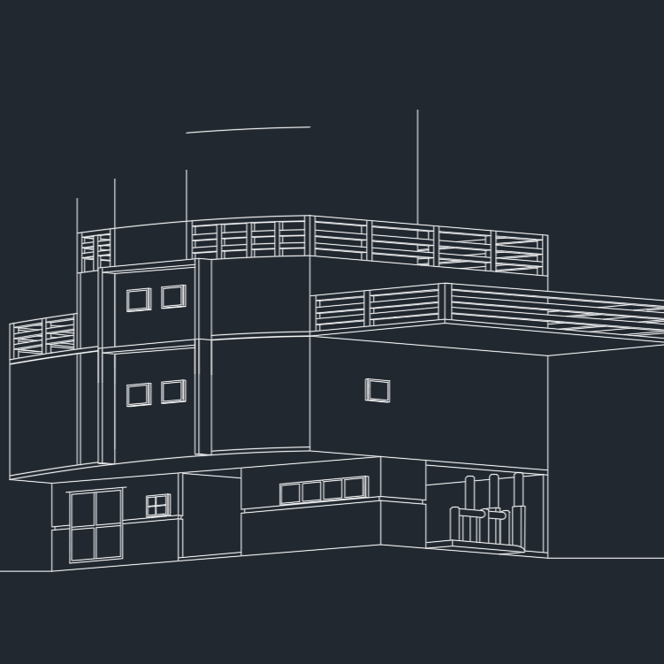

## Learning to Design Systems

When I first began studying architecture, I believed I was learning how to design buildings. What I did not expect was that I was really learning how to design systems. Floor plans, circulation paths, structural grids, and building codes all forced me to think about how individual parts come together to form something that must function reliably for real people. That way of thinking followed me when I transitioned into computer science, and it has fundamentally changed how I approach software engineering.

## Working Within Constraints

In studio, I learned that architecture is less about drawing beautiful buildings and more about making hard design decisions. Every project came with constraints — the site, the program, the budget, and the building code — and the real work was figuring out how to make those constraints coexist. That mindset carried directly into computer science. When I began working with data structures and algorithms, I recognized the same tension: choosing between an array and a linked list was not just a syntactic choice, but a design decision with real consequences for performance, flexibility, and maintainability.

## Designing With Intent

Although I no longer design buildings, I still see myself as a designer. I simply design in code now. Architecture taught me to think in systems, to respect constraints, and to design for real people rather than idealized users. Computer science gave me the tools to turn those ideas into working software. As I continue building my professional portfolio, I aim to create programs that are not only correct, but intentionally designed — thoughtful in structure, clear in purpose, and built to last.
