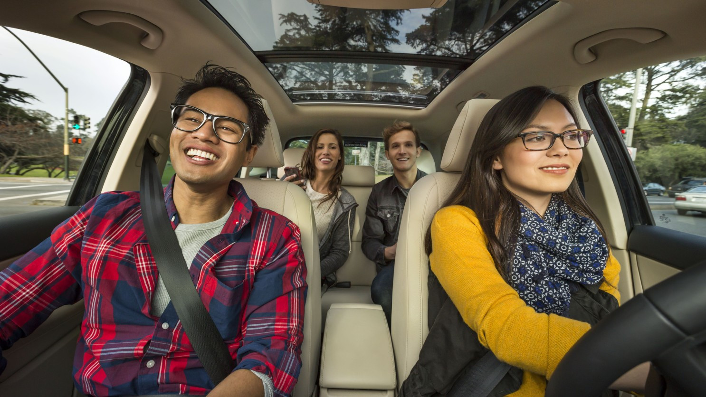

## Proposers

John Gabriel Martinez,
Ella Self,
Mason Vuong,
Peyton,
Tuan Do

## The Problem

At UH Mānoa, a lot of students don’t have access to a car, but still need to run errands regularly. Whether it’s going to Costco, Walmart, Ala Moana, or even just grabbing food off campus, getting there isn’t always easy.

Public transportation can take a long time, and rideshare apps like Uber can get expensive, especially if you’re going alone. Because of that, many students rely on friends or group chats to coordinate rides or errands. The problem is that this process is unorganized and inconsistent. If you don’t know the right people or don’t see the message at the right time, you miss out.

At the same time, a lot of students are already going to the same places at similar times. There just isn’t a simple way to connect those people.

## The Solution

UH Errand Buddy is a web application designed to help UH Mānoa students coordinate errands with each other. Instead of just looking for a ride, students can post or join shared errands.

For example, a user could post that they are going to Costco at a certain time and are willing to share a ride or split costs. Other students who need to go to Costco can join that errand instead of making a separate trip.

This shifts the focus from just transportation to coordination. The app helps students find others with similar plans and makes everyday tasks more efficient and less expensive.

## The Special Sauce

What makes this application more than just a simple listing system is personalization.

Each user will have an account that stores preferences such as common destinations, availability, and types of errands they frequently run. Based on this information, the application can recommend errands that match the user’s habits.

For example, if a user often goes to Ala Moana in the evenings, the app can prioritize showing errands that match that pattern. Instead of searching manually, users receive suggestions tailored to their behavior.

This creates a more dynamic experience where the application adapts to each user over time.

## Mockup Page Ideas

The application will include several main pages:

- **Landing Page**: Introduces the app and allows users to log in or register.
- **Dashboard**: Displays available errands with filters for location, time, and type of errand.
- **Create Errand Page**: A form where users can post a new errand with details such as destination, time, and number of people.
- **Errand Detail Page**: Shows full information about an errand and allows users to join.
- **Profile Page**: Displays saved errands, user preferences, and activity history.

These pages will be built using Next.js for routing, React for component structure, Bootstrap 5 for styling, and hosted using GitHub Pages.

## Use Case Ideas

There are several realistic scenarios where this app would be useful:

- A student wants to go to Costco and joins an errand posted by another student to split transportation costs.
- A driver posts that they are going to Ala Moana and others join the trip.
- A student who frequently runs errands at night receives suggestions for matching errands.
- Users connect with others who have similar schedules and destinations.

## Beyond the Basics

If time allows, additional features could enhance the app:

- A rating system for users to build trust
- A “trusted user” badge based on activity
- Errand history tracking
- A basic messaging system between users

These features would help improve reliability and user experience.

## Final Thoughts

This project focuses on solving a real and everyday problem for UH Mānoa students. Running errands is something most students deal with, and even a simple coordination tool could make it easier, cheaper, and more efficient.

From a software engineering perspective, the project uses modern technologies like Next.js, React, Bootstrap 5, and GitHub hosting, while also incorporating user accounts, database interaction, and personalized features.

Overall, UH Errand Buddy is a practical and scalable idea that balances real-world usefulness with achievable scope.

---

*I used ChatGPT to assist with brainstorming and refining this project idea. The final proposal and explanations reflect my own understanding and perspective.*
