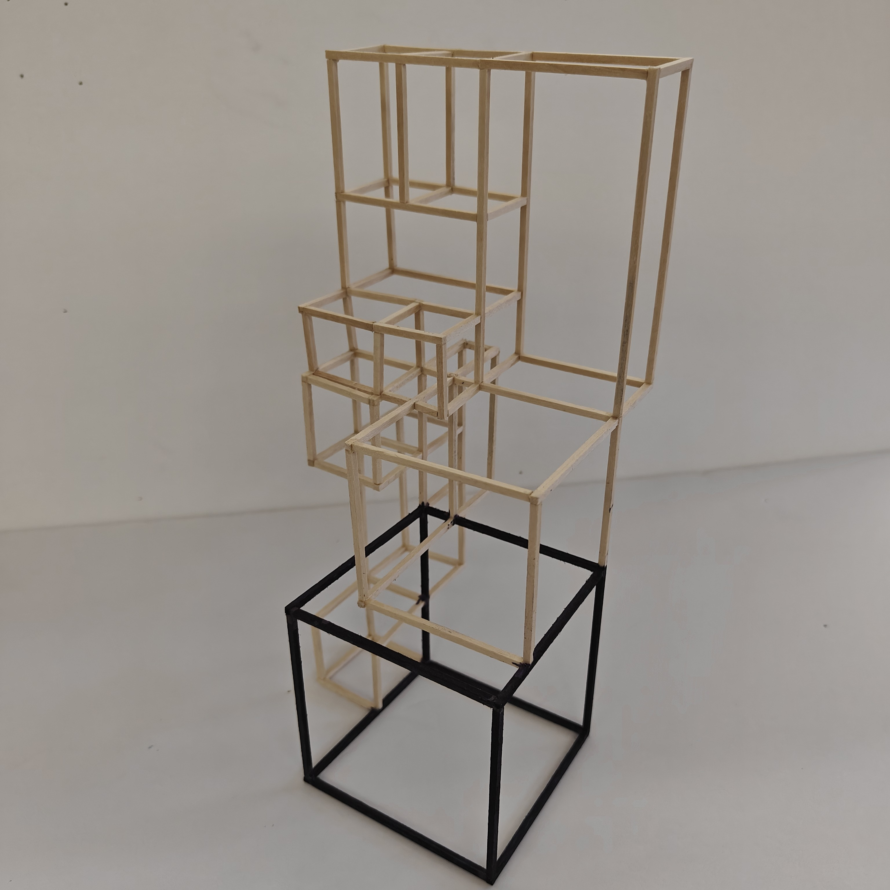
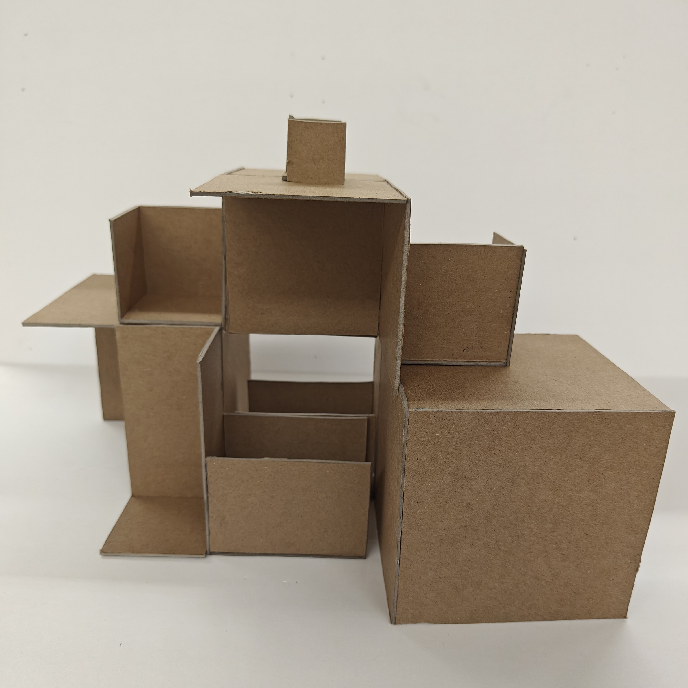
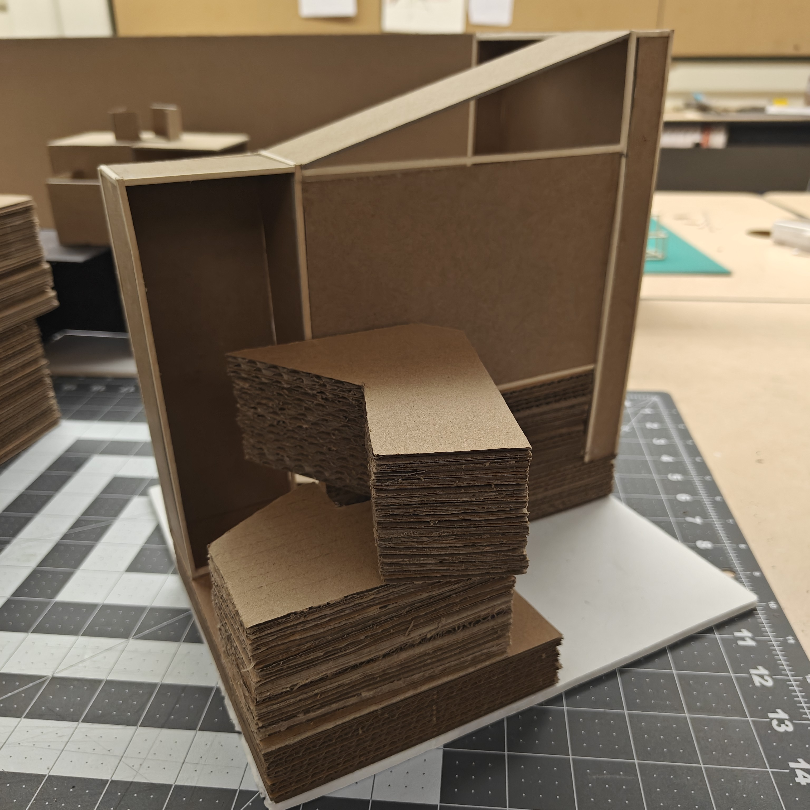

  
  
  

This project consisted of a series of physical study models created to explore spatial organization, massing, and circulation at a human scale. Rather than designing a finished building, the focus was on understanding how volumes relate to one another through stacking, offsetting, carving, and framing. Each model was used as a tool to investigate how space is experienced through movement, section, and proportion.

The models were developed iteratively, beginning with simple cardboard massing studies and progressing toward more refined compositions. Some iterations emphasized solid volumes and layered platforms to study section and vertical movement, while others explored lighter frame-based structures to test transparency, rhythm, and structural logic. Human figures were introduced to evaluate scale, occupancy, and spatial comfort.

Through this process, I learned how small spatial adjustments—such as shifts in height, depth, or alignment—can significantly alter the perception and usability of a space. Building physical models allowed me to identify spatial issues that are not always apparent in drawings alone. This project strengthened my understanding of spatial sequencing, fabrication discipline, and the importance of iterative design in architectural thinking.
