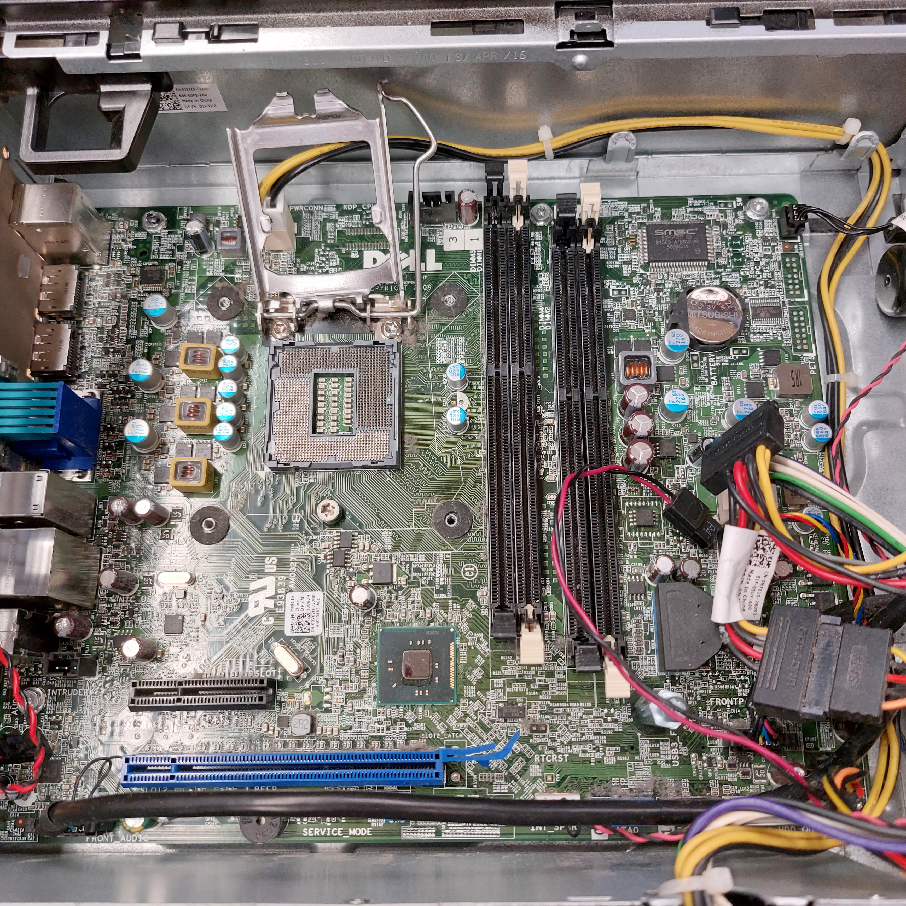
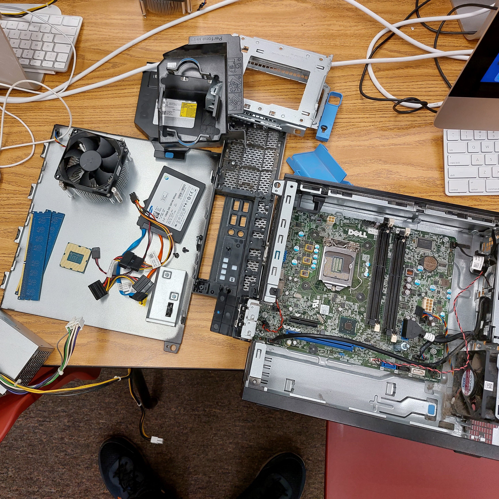

  
  
  

This project involved the complete disassembly and reassembly of a desktop computer system to gain hands-on experience with internal hardware components and system architecture. The process included removing and reinstalling the CPU, cooling assembly, memory modules, power supply, storage devices, and motherboard connections. The goal was to understand how individual components interact to form a functioning computer system and how hardware-level decisions affect system reliability and performance.

Through this project, I developed a practical understanding of computer hardware and low-level system organization that complements my coursework in computer science. I learned how software ultimately depends on correct hardware configuration and gained experience troubleshooting physical system issues. This project strengthened my appreciation for systems-level thinking and reinforced the importance of precision, documentation, and procedural discipline in technical work.
