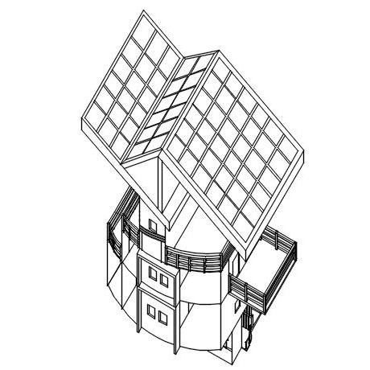
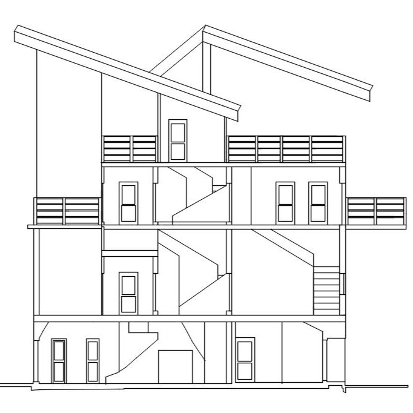
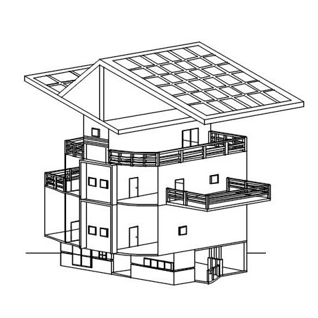

  
  
  

This project involved independently designing a multi-level residential house using AutoCAD. The goal was to develop a complete architectural design that addressed spatial organization, circulation, and overall functionality. The work included creating exterior views, sectional drawings, and interior spatial studies to explore how different levels, rooms, and transitions interact within the structure.

I was solely responsible for all aspects of the design and drafting process. This included developing the overall form of the building, producing sectional drawings to define vertical relationships, and creating detailed interior and exterior representations. Using AutoCAD, I carefully constructed each drawing to maintain consistency across views while refining dimensions, circulation paths, and spatial proportions as the design evolved.

Through this project, I gained hands-on experience using AutoCAD to translate conceptual ideas into precise technical drawings. I learned how sectional and interior drawings reveal spatial relationships that are not immediately apparent in exterior views alone. This process reinforced the importance of iterative refinement, attention to detail, and structured planning when working on a complex, multi-scale design project.

