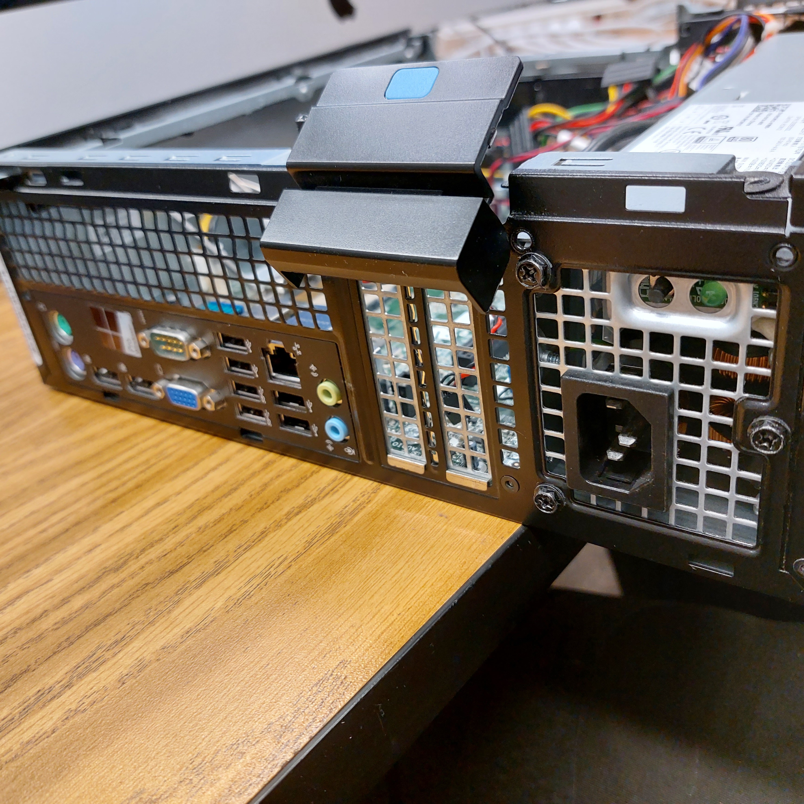

  
  
  

This project involved writing a Java program that determines whether a given year is a leap year based on the rules of the Gregorian calendar. The program evaluates multiple conditions, including special cases such as century years, to ensure accurate results. The main focus of the project was translating a set of written rules into clear and correct program logic.

I completed this project independently, handling the design, coding, and testing of the program. I implemented the conditional logic, tested the program with different input values, and verified that it produced correct results across common and edge-case scenarios.

Through this project, I gained practice writing clear conditional statements and thinking carefully about edge cases. It reinforced the importance of understanding problem requirements fully before coding and showed how even small programs benefit from careful logic and testing.

## Source Code
This project was implemented in Java. The source code can be found here:
- [Leap Year Calculator (Java)]()
