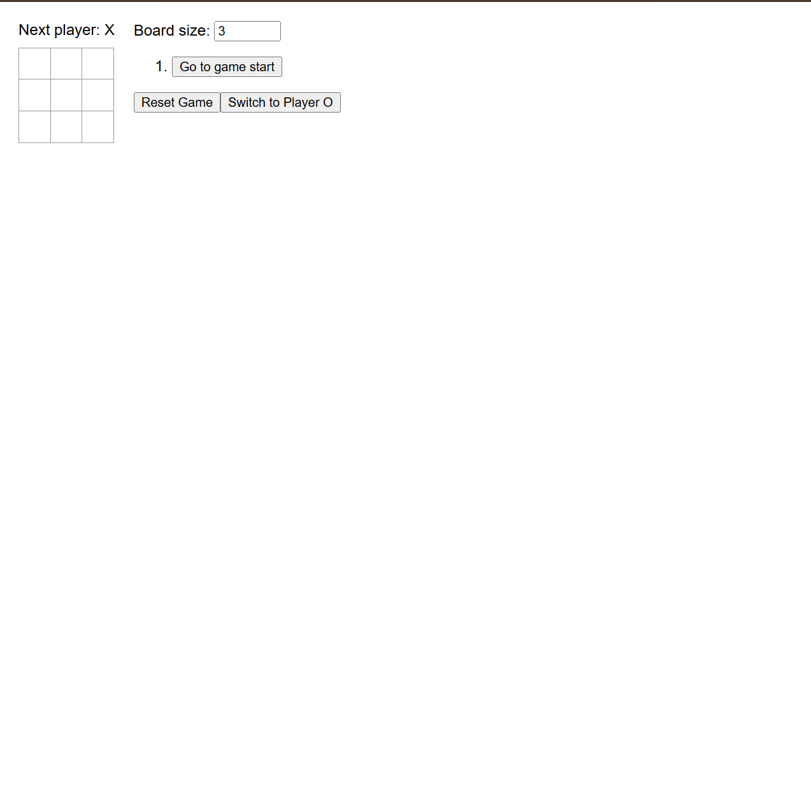
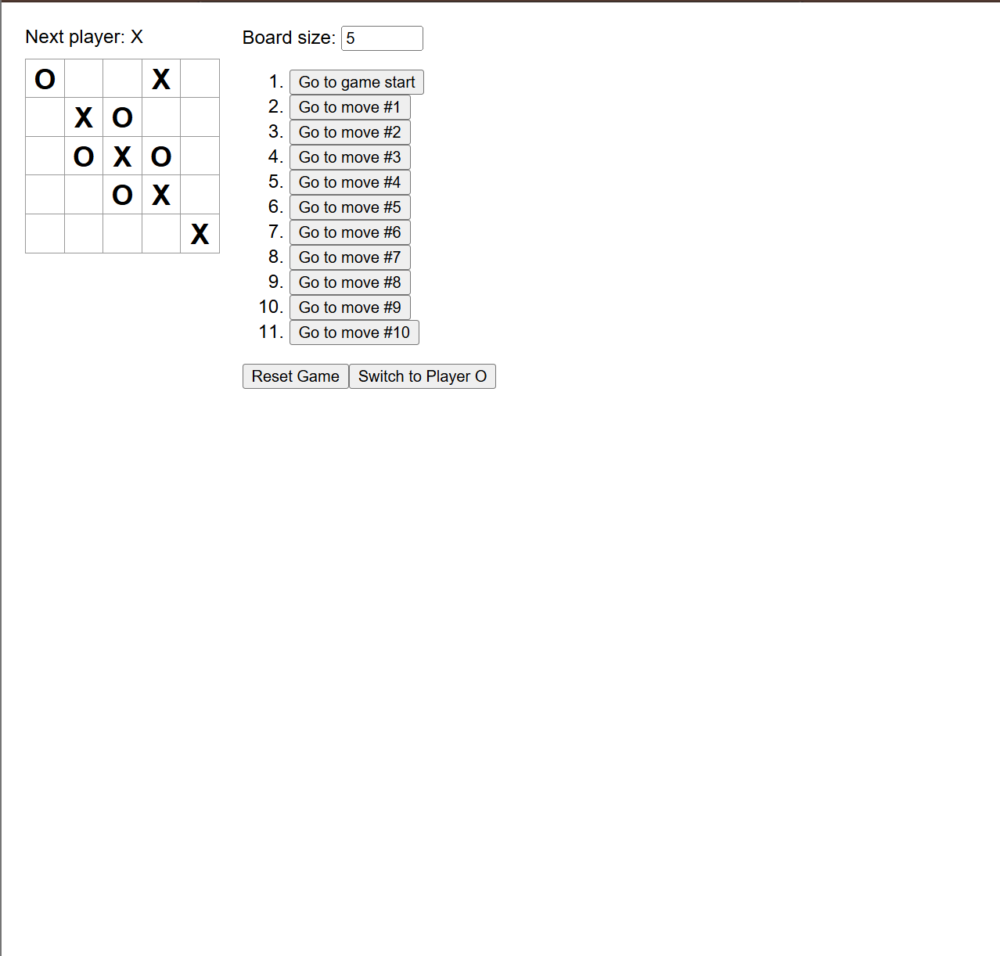

The React Tic-Tac-Toe Game was a frontend project developed during ICS 314 to practice React fundamentals, state management, and interactive UI development. The application expands on the traditional Tic-Tac-Toe game by adding features such as adjustable board sizes, move history tracking, selectable player sides, and a computer-controlled opponent.

The project helped me gain experience building interactive applications using React and managing dynamic user interface updates through component state and event handling.

## Technologies Used

This project was developed using:

- React
- JavaScript
- CSS
- JSX
- React State Management

The project focused on frontend programming concepts such as conditional rendering, interactive user interfaces, dynamic board generation, event handling, and application state management.

## Features

The game includes several interactive features, including:

- Adjustable board sizes
- Computer opponent
- Ability to switch player sides (X or O)
- Move history tracking
- Game reset functionality
- Dynamic game state updates
- Interactive game controls

These features made the project more complex than a standard Tic-Tac-Toe implementation and helped me better understand how React applications manage changing data and user interactions.

## What I Worked On

During development, I worked on implementing the game logic and interactive frontend behavior for the application. This included:

- Rendering the game board dynamically
- Tracking player turns
- Managing move history
- Updating game state after each move
- Creating reset and replay functionality
- Handling board size changes
- Implementing the computer-controlled player
- Structuring React components and event handlers

I also worked on debugging logic errors and improving the responsiveness of the user interface as the board size changed.

## What I Learned

One of the biggest things I learned from this project was how React handles dynamic rendering and state management. Because the game board changes constantly based on player actions, I gained practical experience working with state updates and conditional rendering in real time.

I also learned how quickly application complexity increases when adding additional features. Something as simple as adjustable board sizes or move history tracking required additional logic and careful handling of state changes. This helped me better understand how interactive applications are structured and maintained.

Another important lesson was debugging frontend logic. Small mistakes in game state handling could create incorrect board updates or move tracking issues, so I had to become more careful when organizing component logic and updating state.

Overall, this project strengthened my understanding of React fundamentals and gave me more confidence building interactive frontend applications with dynamic behavior.

Source: <a href="https://github.com/johngabrielmartinez/react-tic-tac-toe">johngabrielmartinez/react-tic-tac-toe</a>
