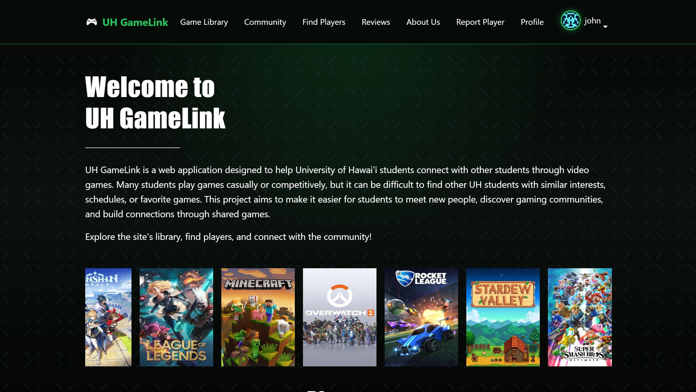
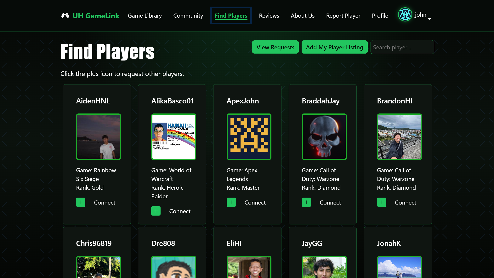
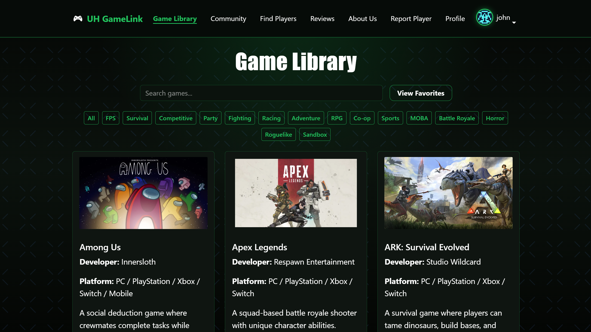

UH GameLink is a full-stack web application developed as a team project during ICS 314 in Spring 2026. The application was designed to help University of Hawaiʻi students connect with one another through shared gaming interests, favorite games, and player listings. Many students play games casually or competitively, but it can be difficult to find other UH students with similar interests, schedules, or gaming communities. UH GameLink was created to make those connections easier.

The application includes features such as a searchable game library, player listings, connection requests, profile customization, reviews, favorite games, and administrative management tools. Throughout the semester, the project evolved incrementally through Agile development practices and GitHub issue-driven project management.

## Technologies Used

UH GameLink was developed using modern full-stack web development technologies including:

- Next.js
- React
- TypeScript
- Prisma ORM
- PostgreSQL
- Playwright
- ESLint
- Bootstrap
- Vercel Deployment
- GitHub and GitHub Issues

The project emphasized not only web development, but also broader software engineering concepts such as configuration management, testing, deployment workflows, debugging, collaboration, and iterative development.

## My Contributions

Throughout the semester, I contributed to multiple areas of the UH GameLink application across frontend development, deployment, testing, UI improvements, and feature implementation.

Some of my major contributions included:

- Implementing and improving profile-related pages, including edit profile and edit interests functionality
- Adding edit functionality for user reviews
- Creating and improving features for the Find Players page
- Implementing pagination and search filtering for player listings
- Fixing layout and responsive design issues across multiple pages
- Updating Playwright automated tests
- Checking and resolving ESLint issues
- Improving Vercel deployment behavior and deployment-related fixes
- Adding request-related functionality for player connections
- Implementing favorite game features
- Improving navbar structure and overall UI consistency
- Adding explanatory content to improve usability on the Reviews page
- Working with database-driven features using Prisma and PostgreSQL

One of the most valuable parts of this experience was learning how interconnected modern web applications can become. Small UI or logic changes could unintentionally affect unrelated systems such as pagination, automated testing, or responsive layouts. Because of that, I learned the importance of incremental commits, debugging carefully, and testing changes frequently throughout development.

## What I Learned

This project taught me far more than simply how to build a website. Through UH GameLink, I gained practical experience with real software engineering workflows including Agile project management, issue-driven development, version control, deployment management, debugging, and automated testing.

I learned how important configuration management and incremental development are when working on larger projects. Throughout development, there were multiple situations where seemingly small changes unexpectedly broke unrelated features. This reinforced the importance of testing carefully, maintaining organized commits, and avoiding large untested rewrites.

I also gained experience working with modern development environments involving multiple interconnected technologies. Using Next.js, Prisma, TypeScript, Playwright, ESLint, and Vercel together showed me how software engineering involves much more than writing code alone. Environment configuration, testing systems, deployment workflows, and framework behavior all play major roles in maintaining stable applications.

Another important lesson involved debugging and problem-solving. Some issues could be solved quickly, while others required tracing problems across frontend components, database queries, routing behavior, or deployment configurations. This project significantly improved my ability to troubleshoot complex issues systematically.

Overall, UH GameLink helped me better understand what software engineering actually involves beyond programming alone. It demonstrated the importance of collaboration, organization, maintainability, testing, and iterative improvement throughout the software development process.

Project Deployment: <a href="https://uh-gamelink.vercel.app/">uh-gamelink.vercel.app</a>

Source: <a href="https://github.com/uh-gamelink/uh-gamelink-app">uh-gamelink/uh-gamelink-app</a>
