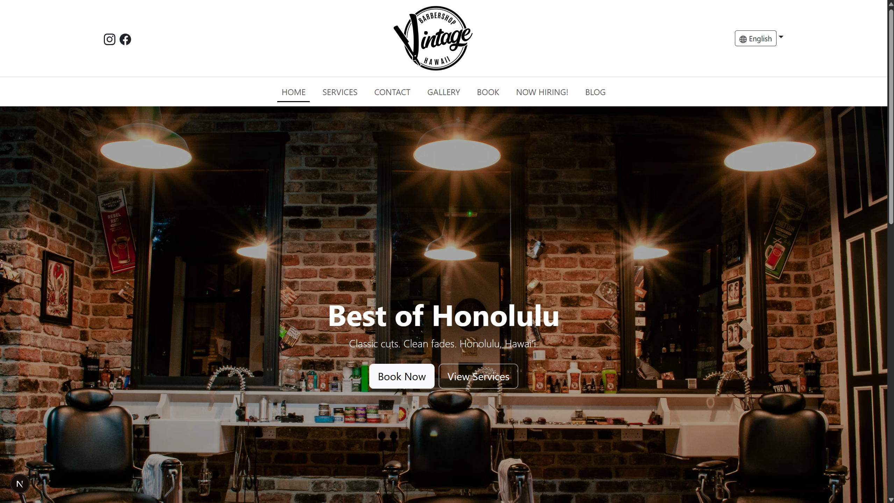
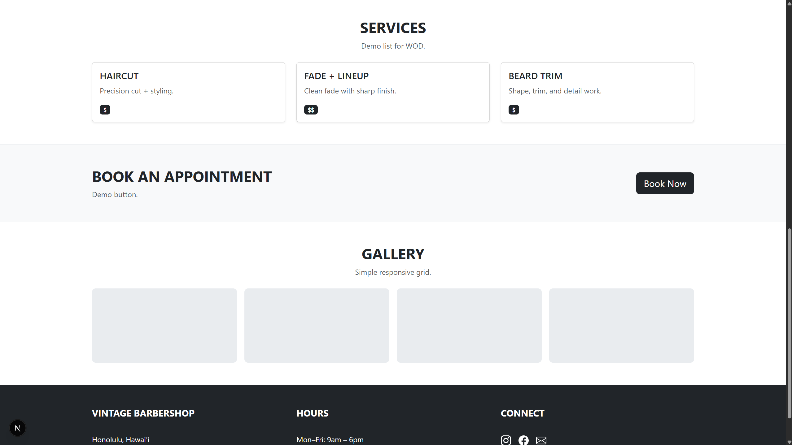

The Vintage Barbershop project was a responsive frontend webpage developed during ICS 314 to practice modern UI development using React, Next.js, Bootstrap, and TypeScript. The project simulated a professional landing page for a barbershop business and included sections such as a navigation bar, hero banner, services section, booking section, gallery, and footer.

The goal of the project was to improve my understanding of responsive layouts, component organization, frontend styling, and Bootstrap integration within a modern React-based development environment.

## Technologies Used

This project was developed using:

- React
- Next.js
- TypeScript
- Bootstrap
- React-Bootstrap
- CSS
- Responsive Grid Layouts

The project emphasized frontend development concepts such as component organization, layout structuring, responsive design, navigation systems, and UI consistency.

## What I Worked On

During development, I worked on building and organizing multiple sections of the webpage including:

- Responsive navigation bar
- Hero landing section
- Services cards layout
- Booking section
- Gallery layout
- Footer section
- Responsive spacing and alignment adjustments
- Bootstrap component integration
- Styling and layout consistency

I also worked through several frontend debugging and configuration issues involving CSS imports, Bootstrap integration, and TypeScript module behavior. This project helped me better understand how frontend frameworks, dependencies, and development environments interact in modern React applications.

## What I Learned

One of the biggest lessons I learned from this project was the importance of responsive design and UI organization in frontend development. Small layout changes could significantly affect spacing, alignment, and responsiveness across the entire page. This helped me become more careful about structuring components and testing layouts at different screen sizes.

I also gained more experience working with Bootstrap and React-Bootstrap components within a Next.js environment. Through debugging import errors and styling issues, I developed a better understanding of dependency management, CSS handling, and project configuration in modern frontend applications.

Another important takeaway was learning how much planning and refinement goes into creating clean user interfaces. Even relatively simple webpages require careful attention to spacing, typography, responsiveness, and consistency in order to feel polished and professional.

Overall, this project strengthened my frontend development skills and gave me more confidence building responsive webpages using modern frontend frameworks and UI libraries.

Source: <a href="https://github.com/johngabrielmartinez/yourchoice-react">Github Repo</a>
